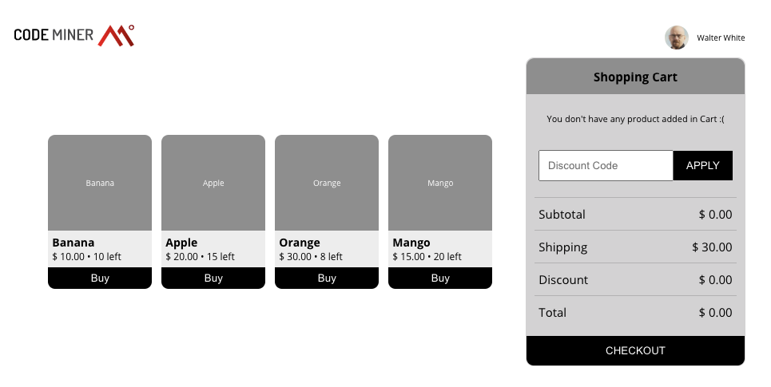
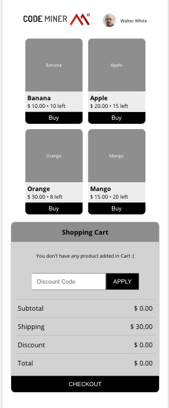

# About the project:
This project aims to solute the following problem:

( https://gist.github.com/sobrinho/2f8d633aab22e3ad6ffa0b9d19b5a131#shopping-cart)

## Deployed project reference.
👉 https://suspicious-johnson-56fd93.netlify.app/
## Desktop and Mobile.




## Topics:
* Axios
* Functional JS: Map, Filter, Reducer, Find
* Modularization: BEM-CSS Block element modifier
* Presentational e Container Components
* React Hooks, useState, useEffect
* React Testing Library
* React

## Dependencies
```json
{
    "@testing-library/jest-dom": "^4.2.4",
    "@testing-library/react": "^9.3.2",
    "@testing-library/user-event": "^7.1.2",
    "axios": "^0.19.2",
    "node-sass": "^4.14.1",
    "react": "^16.13.1",
    "react-dom": "^16.13.1",
    "react-scripts": "3.4.1"
}
```

You can install all necessaries dependencies through Yarn or NPM

- Yarn ▶️ yarn install
- NPM ▶️ npm i

## Requirements:
* Node v13.8.0 - or higher
* Create React App

>Special Thanks to Vinicius Vinna (https://github.com/ViniciusVinna) for provide this readme template.

@rribeiro97
Commit changes
